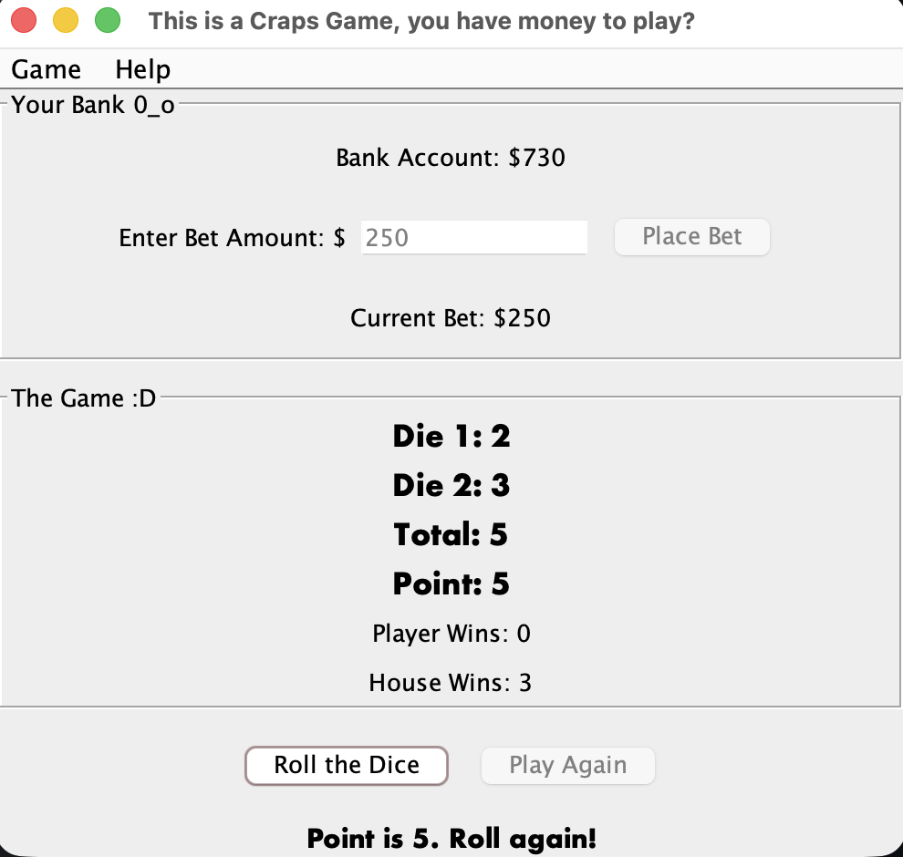

# Craps Casino Game (Java + Swing)

A desktop implementation of the casino dice game **Craps**, written in Java with a Swing GUI, sound feedback synthesized at runtime, and an MVC architecture wired together with the JavaBeans `PropertyChangeListener` event model. Includes a JUnit 5 test suite covering betting validation and core game-rule outcomes.

> Built as a personal project to practice object-oriented design, event-driven UI programming, and decoupling game logic from presentation for testability. README.md autogenerated from AI.

---

## Table of Contents

- [Demo](#demo)
- [Features](#features)
- [Architecture](#architecture)
- [Tech Stack](#tech-stack)
- [How to Play](#how-to-play)
- [Getting Started](#getting-started)
- [Running the Tests](#running-the-tests)
- [Project Structure](#project-structure)
- [Design Notes](#design-notes)
- [What I Learned](#what-i-learned)
- [Future Improvements](#future-improvements)
- [Author](#author)

---

## Demo

<!-- Drop a GIF or PNG of the running app into docs/screenshots/ and update the path below. -->


---

## Features

- **Full Craps rule set** — come-out roll (7 / 11 win, 2 / 3 / 12 lose), point-phase rolls, and 7-out losses.
- **Bank account and betting system** — start with a custom bankroll, place per-round bets, double your bet on wins, lose your bet on house wins.
- **Swing GUI** with menu bar (Game / Help), keyboard mnemonics, accelerator shortcuts (`Ctrl+S`, `Ctrl+R`, `Ctrl+Q`, etc.), and confirmation dialogs.
- **Sound feedback** for dice rolls, wins, and losses — generated at runtime via synthesized sine-wave tones (no `.wav` asset files required).
- **Event-driven UI** — the view subscribes to model property changes via `PropertyChangeListener`, so game state and UI stay in sync without tight coupling.
- **Reset and replay** — reset the whole session or play another round at the click of a button.
- **Input validation** with friendly error dialogs for invalid bets, negative numbers, and non-numeric input.
- **Color-flashed status messages** for wins (green) and losses (red), with an auto-reset timer.

---

## Architecture

The project follows a **Model–View–Controller (MVC) pattern**, with the model exposing changes through Java's `PropertyChangeSupport` so the view can observe game state without depending on Swing internals.

```
┌──────────────────────┐    user input    ┌──────────────────────┐
│   CrapsGameView      │ ───────────────▶ │      CrapsGame       │
│   (Swing UI)         │                  │      (Model)         │
│                      │ ◀─────────────── │                      │
│  PropertyChange-     │  property events │  PropertyChange-     │
│  Listener            │                  │  Support             │
└──────────┬───────────┘                  └──────────────────────┘
           │
           │ plays
           ▼
┌──────────────────────┐
│   CrapsGameSounds    │  ← synthesized sine-wave tones via
│   (audio utility)    │    javax.sound.sampled.SourceDataLine
└──────────────────────┘

           ▲
           │ launches
┌──────────────────────┐
│  CrapsGameController │  ← main() entry point, wires model + view
│  (bootstrap)         │     on the Swing Event Dispatch Thread
└──────────────────────┘
```

- **Model (`CrapsGame.java`)** — pure game state and rules. Has no Swing imports and is fully unit-testable in isolation.
- **View (`CrapsGameView.java`)** — Swing `JFrame` that renders state, captures user input, and listens for model events.
- **Controller (`CrapsGameController.java`)** — application entry point; constructs the model and view on the Event Dispatch Thread.
- **Sound utility (`CrapsGameSounds.java`)** — generates short tones for game events asynchronously on a background thread so audio never blocks the UI.

---

## Tech Stack

| Layer       | Technology                                                  |
|-------------|-------------------------------------------------------------|
| Language    | Java 25                                                     |
| GUI         | Java Swing (`JFrame`, `JMenuBar`, `JOptionPane`, layouts)   |
| Events      | JavaBeans `PropertyChangeSupport` / `PropertyChangeListener`|
| Audio       | `javax.sound.sampled` (`SourceDataLine`, `AudioFormat`)      |
| Testing     | JUnit 5 (Jupiter)                                           |
| Build       | [e.g., IntelliJ project / Gradle / Maven — fill in]         |

---

## How to Play

1. From the menu bar, choose **Game → Start** and enter a starting bank amount.
2. Type a bet amount and click **Place Bet**.
3. Click **Roll the Dice**.
   - **Come-out roll:**
     - Roll **7** or **11** → you win, bet is doubled and returned.
     - Roll **2**, **3**, or **12** → house wins, bet is lost.
     - Any other total becomes your **point**.
   - **Point phase:**
     - Roll your point again → you win.
     - Roll **7** → house wins.
     - Any other roll → roll again.
4. After a round ends, click **Play Again** to bet on a new round.
5. Use **Game → Reset Game** to start over, or **Help → Rules** any time you forget how Craps works.

---

## Getting Started

### Prerequisites

- **JDK 21 or higher** (developed against JDK 25)
- (Optional) IntelliJ IDEA, Eclipse, or VS Code with the Java extension pack

### Run from the command line

```bash
# Clone the repo
git clone https://github.com/iiSurf/[repo-name].git
cd [repo-name]

# Compile (adjust source paths to match your structure)
javac -d out src/*.java

# Run
java -cp out CrapsGameController
```

### Run from an IDE

1. Open the project folder in your IDE.
2. Mark the source folder as a **Sources Root**.
3. Run `CrapsGameController.main()`.

---

## Running the Tests

The project includes a JUnit 5 test suite (`CrapsGameTest.java`) covering:

- Bank account initialization and updates
- Bet placement (valid amounts, negative bets, over-balance bets)
- Win/loss bankroll math (doubled payout, reset bet)
- Deterministic dice scenarios via `setDiceForTesting()` /
  `setDiceForTestingOnly()`:
  - Natural win on **7** (come-out)
  - Natural win on **11** (come-out)
  - Craps loss on **2** (come-out)

### Run with Gradle

```bash
./gradlew test
```

### Run with Maven

```bash
mvn test
```

### Run from IntelliJ

Right-click `CrapsGameTest.java` → **Run 'CrapsGameTest'**.

---

## Project Structure

```
.
├── src/
│   ├── CrapsGame.java             # Model: game state, rules, betting, dice
│   ├── CrapsGameView.java         # View: Swing UI + PropertyChangeListener
│   ├── CrapsGameController.java   # Entry point: wires model + view on EDT
│   └── CrapsGameSounds.java       # Audio utility: synthesized tones
├── test/
│   └── CrapsGameTest.java         # JUnit 5 tests
├── docs/
│   └── screenshots/               # README images
└── README.md
```

---

## Design Notes

A few intentional design decisions worth calling out:

- **Model is Swing-free.** `CrapsGame` has zero `javax.swing` imports, which is what makes the unit tests possible. The view subscribes to it via `PropertyChangeListener`, not the other way around.
- **Deterministic dice for tests.** Random dice rolls are inherently hard to test, so the model exposes `setDiceForTesting(int, int)` that pre-loads the next roll. A boolean flag (`myUseSetDice`) ensures the override is consumed exactly once, preventing test state from leaking into subsequent rolls.
- **Sounds run on a background thread.** `playSoundAsync` spawns a new `Thread` per cue so the Swing Event Dispatch Thread is never blocked by `SourceDataLine.drain()`.
- **Tones synthesized at runtime.** Instead of shipping `.wav` files, win/lose/roll cues are generated by writing sine-wave samples into a `SourceDataLine` — a single audio utility, no external assets.
- **EDT discipline.** The controller launches the UI via `EventQueue.invokeLater`, keeping all Swing construction on the Event Dispatch Thread per Swing threading rules.

---

## What I Learned

I built a nontrivial Java Swing app using MVC, which made the model easy to unit test and kept UI concerns separate. I relied on JavaBeans property‑change events for a lightweight observer pattern and leaned on practical Swing techniques like nested layouts, menus with mnemonics and accelerators,
modal dialogs, and correct Event Dispatch Thread usage. I also generated PCM audio directly with javax.sound.sampled, and focused on testability by inverting dependencies and adding deterministic seams such as setDiceForTesting so game rules can be verified without the UI.
---

## Future Improvements

- Replace dice text labels with png file dice graphics.
- Persist high scores / largest bankrolls between sessions to disk.
- Add additional Craps bets (Don't Pass, Odds, Field, Place bets).
- Refactor the sound utility to support volume control and stereo output.
- Package as a runnable `.jar` with `jpackage` for cross-platform distribution.

---

## Author

**Nick Humeniuk-Sandberg**
- LinkedIn: [linkedin.com/in/nick-hsd](https://www.linkedin.com/in/nick-hsd)
- GitHub: [github.com/iiSurf](https://github.com/iiSurf)

---

## License

[MIT](LICENSE)
